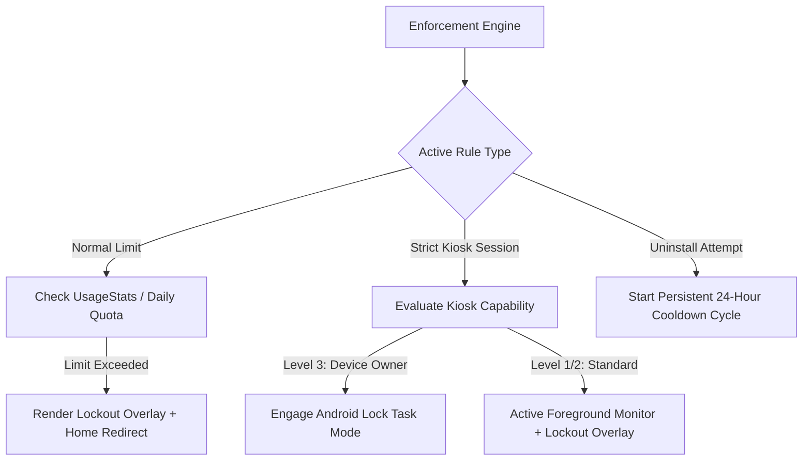

# ⏳ FocusGuard — Android App Time Use Limiter

> An open-source, privacy-first, battery-efficient Android application designed to help users curb phone addiction, enforce daily app time limits, and build healthier digital habits through customizable lockout rules and analytics.

---

## 📋 Table of Contents

- [Vision & Goals](#-vision--goals)
- [Key Features](#-key-features)
- [System Architecture](#-system-architecture)
- [Android Permissions & System Integrations](#-android-permissions--system-integrations)
- [Technology Stack](#-technology-stack)
- [Project Directory Blueprint](#-project-directory-blueprint)
- [Development Roadmap & Milestones](#-development-roadmap--milestones)
- [Antigravity Agent (`.agents`) Setup](#-antigravity-agent-agents-setup)
- [Getting Started](#-getting-started)
- [Privacy & Security](#-privacy--security)

---

## 🎯 Vision & Goals

Excessive smartphone usage and digital distractions reduce productivity and disrupt sleep. Existing screen time solutions are often easily bypassed, excessively drain battery life, or harvest private app usage telemetry.

**FocusGuard** solves this by offering:
1. **Un-bypassable Restrictions**: Strict mode, PIN challenges, and full-screen lockout overlays prevent impulsive bypasses.
2. **100% On-Device Privacy**: Usage statistics and rules never leave the device.
3. **Battery-Optimized Background Tracking**: Leveraging event-driven `UsageStatsManager` APIs and lightweight foreground monitoring.
4. **Modern Android UI**: Built with Jetpack Compose and Material 3 for an intuitive user experience.

---

## ✨ Key Features

### 1. App Usage Limits & Quotas
- **Daily Time Limits**: Set custom screen time allowances per app (e.g., 30 mins/day for Instagram).
- **Hourly Budgets**: Restrict usage within sliding hourly windows to prevent binge usage.
- **Launch Count Caps**: Limit the number of times distracting apps can be opened per day.
- **Category Quotas**: Group multiple apps (e.g., all Social Media or Games) under a shared time pool.

### 2. Scheduled Focus Modes & Bedtime Lockout
- **Scheduled Sessions**: Automatically block non-essential apps during work hours, study time, or bedtime.
- **Whitelist / Blacklist**: Pick specific productive apps allowed during focus sessions.

### 3. Smart Lockout & Overlays
- **Full-Screen Lockout Overlay**: Displays a sleek blocking overlay (`SYSTEM_ALERT_WINDOW`) when an app's quota is reached.
- **Home Screen Redirect**: Immediately returns user to their home launcher upon limit violation.
- **Mindful Prompts**: Displays motivational quotes, daily screen time summaries, and intentional breathing exercises when blocked.
- **Grace Period / Emergency Override**: Optional 1-minute or 5-minute extension with strict daily limits.

### 4. Anti-Cheat, Strict Mode, Anti-Clock Tampering & 24-Hour Uninstall Cooldown
- **Anti-Clock Tampering & Monotonic Time Protection**: Countdowns and limits use `SystemClock.elapsedRealtime()` (milliseconds since boot including deep sleep). If a user fast-forwards their device date/time in Android Settings, the tampering is detected, and countdowns refuse to expire until true monotonic time has legitimately elapsed.
- **24-Hour Uninstall Cooldown**: Initiating app removal or disabling protection triggers a persistent 24-hour waiting period. After 24 hours, the user can either cancel or confirm (with a mandatory 10-second reflection delay). If "Uninstall" is chosen, another 24-hour cycle begins to ensure conscious reconsideration.
- **PIN / Password Protection**: Require a master PIN to alter limits, disable rules, or unlock apps.
- **Strict Kiosk Focus Mode (Levels 1–3)**: User-started timed focus sessions preventing environment exit via standard overlays (Level 1/2) or native Android Lock Task Mode (Level 3 - Device Owner).
- **Uninstall Prevention**: Optional Device Administration policy to prevent impulsive uninstallation during active focus sessions.

### 5. Detailed Usage Analytics & Dashboards
- **Daily & Weekly Trends**: Interactive screen time charts and comparison against prior days.
- **Top Apps Breakdown**: View most used apps, launch frequencies, and peak usage hours.
- **Milestones & Streaks**: Celebrate days where all limits were successfully respected.


---

## 🏗 System Architecture

The application adheres to **Clean Architecture** and **Unidirectional Data Flow (UDF / MVI)**:

```
┌─────────────────────────────────────────────────────────────────────────┐
│                           PRESENTATION LAYER                            │
│  Jetpack Compose Screens │ ViewModels │ UI StateFlows │ UI Effects      │
└────────────────────────────────────▲────────────────────────────────────┘
                                     │
┌────────────────────────────────────┴────────────────────────────────────┐
│                              DOMAIN LAYER                               │
│  Use Cases │ Domain Models (FocusSession, AppLimitRule) │ Repositories  │
└────────────────────────────────────▲────────────────────────────────────┘
                                     │
┌────────────────────────────────────┴────────────────────────────────────┐
│                               DATA LAYER                                │
│  Room DB │ DataStore │ UsageStatsDataSource │ KioskController           │
└─────────────────────────────────────────────────────────────────────────┘
```

### Multi-Tier Enforcement & Background Flow



---

## 🔑 Android Permissions & System Integrations

| Permission | API Level | Purpose | User Flow |
| :--- | :--- | :--- | :--- |
| `PACKAGE_USAGE_STATS` | API 21+ | Read foreground app events & calculate daily screen time | Directed to `Settings.ACTION_USAGE_ACCESS_SETTINGS` |
| `SYSTEM_ALERT_WINDOW` | API 23+ | Render full-screen lockout overlay directly over blocked apps | Directed to `Settings.ACTION_MANAGE_OVERLAY_PERMISSION` |
| `FOREGROUND_SERVICE` | API 28+ | Keep active monitoring alive in background with persistent notification | Automatically granted in Manifest |
| `POST_NOTIFICATIONS` | API 33+ | Send proactive warnings (e.g., "5 minutes remaining") | Standard runtime permission prompt |
| `REQUEST_IGNORE_BATTERY_OPTIMIZATIONS` | API 23+ | Whitelist from OEM battery task killers | System dialog prompt |
| `RECEIVE_BOOT_COMPLETED` | All | Automatically start monitoring service upon device reboot | Manifest declaration |

---

## 🛠 Technology Stack

- **Core Language**: Kotlin 2.x
- **UI Toolkit**: Jetpack Compose + Material 3
- **Asynchronous**: Kotlin Coroutines (`Dispatchers.IO`, `Dispatchers.Default`) + Kotlin Flow (`StateFlow`)
- **Dependency Injection**: Jetpack Hilt
- **Database & Persistence**: Room ORM (SQLite) + Jetpack DataStore Preferences
- **System Monitoring**: `UsageStatsManager`, `AppOpsManager`, `WindowManager`, `DevicePolicyManager` (Lock Task Mode)
- **Background Tasks**: Android `WorkManager` & `ForegroundService`
- **Testing**: JUnit 5, MockK, Turbine, Robolectric, Compose UI Test

---

## 📁 Project Directory Blueprint

```text
app/
 ├── data/
 │    ├── local/
 │    │    ├── db/                     # Room Entities, DAOs, Database
 │    │    │    ├── entity/
 │    │    │    │    ├── AppLimitEntity.kt
 │    │    │    │    ├── FocusSessionEntity.kt
 │    │    │    │    ├── FocusScheduleEntity.kt
 │    │    │    │    └── UsageHistoryEntity.kt
 │    │    │    ├── dao/
 │    │    │    │    ├── AppLimitDao.kt
 │    │    │    │    ├── FocusSessionDao.kt
 │    │    │    │    └── UsageHistoryDao.kt
 │    │    │    └── AppDatabase.kt
 │    │    ├── datastore/              # Preferences, Security & Uninstall Cooldown
 │    │    │    └── SettingsDataStore.kt
 │    │    ├── kiosk/                  # Kiosk Controller Implementations
 │    │    │    ├── AndroidLockTaskKioskController.kt
 │    │    │    └── OverlayKioskController.kt
 │    │    └── stats/                  # Android UsageStats wrapper
 │    │         └── UsageStatsDataSource.kt
 │    └── repository/                  # Repository implementations
 │         ├── AppUsageRepositoryImpl.kt
 │         ├── AppLimitRepositoryImpl.kt
 │         ├── FocusSessionRepositoryImpl.kt
 │         └── UninstallProtectionRepositoryImpl.kt
 ├── domain/
 │    ├── model/                       # Domain data models
 │    │    ├── AppUsageSummary.kt
 │    │    ├── AppLimitRule.kt
 │    │    ├── FocusSession.kt
 │    │    ├── UninstallProtectionState.kt
 │    │    └── LockoutState.kt
 │    ├── repository/                  # Repository interfaces
 │    │    ├── AppUsageRepository.kt
 │    │    ├── AppLimitRepository.kt
 │    │    ├── FocusSessionRepository.kt
 │    │    └── UninstallProtectionRepository.kt
 │    └── usecase/                     # Business Logic
 │         ├── GetDailyUsageStatsUseCase.kt
 │         ├── CheckAppLimitReachedUseCase.kt
 │         ├── StartFocusSessionUseCase.kt
 │         ├── StartUninstallCooldownUseCase.kt
 │         ├── ConfirmUninstallDecisionUseCase.kt
 │         └── ValidateSecurityPinUseCase.kt
 ├── presentation/
 │    ├── common/                      # Reusable UI & Theme
 │    │    ├── theme/                  # Color.kt, Type.kt, Theme.kt
 │    │    └── components/             # AppIcon, ProgressRing, PinKeypad
 │    ├── dashboard/                   # Main Screen Time Dashboard
 │    ├── limits/                      # App Limits Manager
 │    ├── focus/                       # Strict Kiosk Focus Mode Screen
 │    ├── lockout/                     # Full-Screen Lockout Overlay UI
 │    ├── uninstall/                   # 24-Hour Uninstall Cooldown & Confirmation UI
 │    └── onboarding/                  # Step-by-Step Permission Setup
 └── service/
      ├── monitoring/                  # Foreground Monitoring Service
      │    ├── AppMonitorService.kt
      │    └── LockoutOverlayManager.kt
      └── receiver/                    # Boot & Alarm Receivers
           └── BootCompletedReceiver.kt
```

---

## 🗺 Development Roadmap & Milestones

- [x] **Phase 0: Planning & Architecture Definition** *(Current)*
  - [x] Establish architectural blueprint and data flow models.
  - [x] Setup `.agents/` workspace rules, agent guidelines, and specialized skills.
  - [x] Integrate Strict Kiosk Mode & 24-Hour Uninstall Cooldown specifications.
  - [x] Create comprehensive project documentation (`README.md`).
- [ ] **Phase 1: Project Initialization & Core Data Layer**
  - [ ] Initialize Android project with Gradle Kotlin DSL and Hilt.
  - [ ] Implement `UsageStatsDataSource`, `KioskController`, and `Room` entities/DAOs (`FocusSessionEntity`, `AppLimitEntity`).
  - [ ] Implement `UninstallProtectionRepository` backed by Room/DataStore with absolute timestamps.
  - [ ] Write unit tests for repositories and aggregation logic.
- [ ] **Phase 2: Domain Layer & Business Logic**
  - [ ] Implement use cases for querying usage stats, evaluating limits, managing kiosk focus sessions, and 24-hour uninstall cooldown cycles.
  - [ ] Unit test edge cases (midnight rollovers, timezone shifts, reboot recovery, timer calculations).
- [ ] **Phase 3: Background Service & Enforcement Engine**
  - [ ] Build `AppMonitorService` (Foreground Service) with low CPU footprint.
  - [ ] Implement `LockoutOverlayManager` using `SYSTEM_ALERT_WINDOW` and Home redirection.
  - [ ] Integrate `LockTaskMode` for Level 3 dedicated kiosk enforcement.
  - [ ] Implement `BootCompletedReceiver` for session & cooldown restoration.
- [ ] **Phase 4: Presentation Layer (Jetpack Compose)**
  - [ ] Build Permission Onboarding Wizard (`Usage Access`, `Overlay`, `Notifications`).
  - [ ] Build Screen Time Dashboard with daily/weekly charts.
  - [ ] Build Strict Focus Mode Session Screen with derived countdown.
  - [ ] Build 24-Hour Uninstall Cooldown screen with 10-second reflection delay.
  - [ ] Build the interactive Lockout Screen (quotes, timer, PIN override).
- [ ] **Phase 5: Strict Mode, Testing & Polish**
  - [ ] PIN hashing and Keystore security integration.
  - [ ] Integration testing with Robolectric and Compose UI tests.
  - [ ] Battery profiling and performance optimization.

---

## 🤖 Antigravity Agent (`.agents`) Setup

This repository is equipped with Antigravity workspace customizations in `.agents/`:

### Rules (`.agents/AGENTS.md` & `.agents/rules/`)
- **[AGENTS.md](.agents/AGENTS.md)**: Defines coding standards (Kotlin 2.x, Compose, UDF), local-first privacy mandates, background battery guidelines, Strict Kiosk Focus Mode (Levels 1–3), and 24-Hour Uninstall Cooldown rules.
- **[android-architecture.md](.agents/rules/android-architecture.md)**: Specifies Clean Architecture layer boundaries, database schemas, and state management rules.

### Skills (`.agents/skills/`)
- **[`usage-stats-tracking`](.agents/skills/usage-stats-tracking/SKILL.md)**: Procedures and code patterns for querying `UsageStatsManager`, `UsageEvents`, and managing usage access permissions.
- **[`app-blocking-and-limits`](.agents/skills/app-blocking-and-limits/SKILL.md)**: Procedures for background evaluation, system alert overlays (`SYSTEM_ALERT_WINDOW`), PIN unlock, and the 24-hour uninstall cooldown state pattern.
- **[`strict-kiosk-mode`](.agents/skills/strict-kiosk-mode/SKILL.md)**: Procedures for Lock Task Mode (`Activity.startLockTask`), Device Policy Manager integration, session state persistence, and reboot recovery.
- **[`android-build-and-test`](.agents/skills/android-build-and-test/SKILL.md)**: Step-by-step instructions for Gradle builds, linting, and unit/integration tests with JUnit, MockK, and Robolectric.

---

## 🔒 Privacy & Security

- **Zero Network Transmission**: FocusGuard does not contain internet-facing telemetry or tracking SDKs.
- **Encrypted Credentials**: Master PIN and security preferences are encrypted using Android Keystore.
- **Transparent Open Source**: All background routines and system permission usages are open and auditable.

